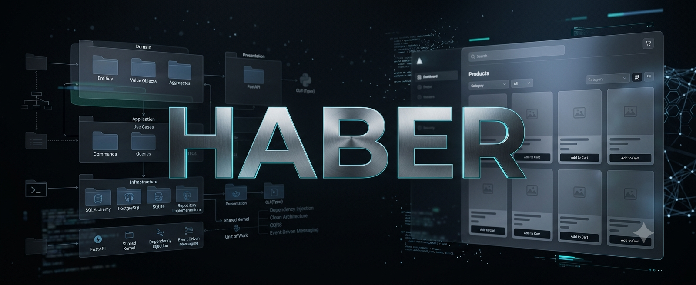
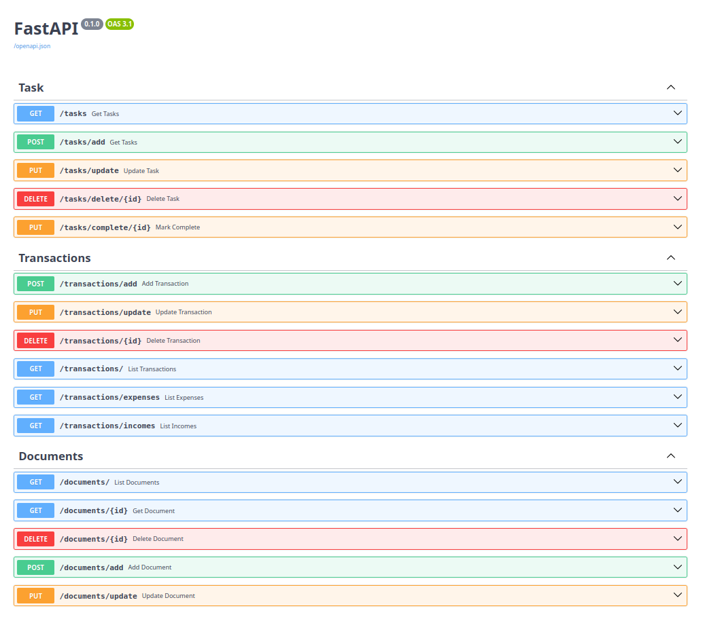

<div align="center">



# Personal Planner

### A Modern Personal Productivity Platform Built with Python & Domain-Driven Design

<p>
Personal Planner is an extensible productivity platform designed around <strong>Domain-Driven Design (DDD)</strong>, Clean Architecture principles, and modern development practices. The goal of this project is to provide a robust backend that can evolve into a complete productivity ecosystem with a powerful CLI, React frontend, plugin architecture, and automated project scaffolding.
</p>

<p>


</p>

</div>

---

# About

Personal Planner is much more than a simple task manager.

It is an experimental productivity platform that focuses on building a scalable and maintainable architecture capable of supporting multiple productivity modules under a single ecosystem.

Instead of tightly coupling business logic with frameworks, the project follows Domain-Driven Design to keep the domain independent, testable, and future-proof.

Current modules include task management and financial transaction management, while many additional capabilities are planned for future releases.

---

# Features

-You can control your tasks
-You can audit your transaction
-You can write documents

## Current

- Domain-Driven Design (DDD)
- Clean Architecture
- Repository Pattern
- Task Management
- Transaction Management
- PostgreSQL Support
- Alembic Database Migrations
- Docker Support
- Dependency Injection Ready
- Modular Architecture
- Scalable Project Structure

---

# Project Preview

## Dashboard



---

<!-- ## Architecture


--- -->

# Technology Stack

| Layer | Technology |
|--------|------------|
| Language | Python |
| Database | PostgreSQL AND SQLite|
| ORM | SQLAlchemy |
| Migration | Alembic |
| Container | Docker |
| Architecture | Domain Driven Design |
| Pattern | Repository Pattern |
| Version Control | Git |

---

# Getting Started

### -First, Clone the repository

```bash git clone https://github.com/ehsanvahedian/Haber.git ```


### enter to file


```bash
cd Haber
```
### Automatic installation

#### run bash file
```bash
bash init.sh #if you have not UV installed
bash init.uv.sh #if you have UV installed
```
### manual installation

#### For UV:
```bash
uv sync # In src directory
uv run main.py # In src

## Help panel will appear.
```

#### without UV

Create virtual environment
```bash
python -m venv .venv # In src directory
```

Activate environment

```bash
source .venv/bin/activate
```

Install dependencies

```bash
pip install . # In src directory
```

run main.py file

```bash
python main.py
```
---
<!-- 
# Docker

Run the complete development environment

```bash
docker compose up --build
```

Stop containers

```bash
docker compose down
```

--- -->


# Future Vision

Personal Planner is being developed as a complete productivity ecosystem.

The roadmap currently includes:

* React Frontend Adapter
* Authentication
* Notification Center
* Calendar Integration
* Scheduler
* Multiple Database Providers
* AI Assistant
* Cloud Synchronization
* Desktop Application
* Mobile Companion
* Theme Support
* Backup & Restore
* Import / Export
* Dashboard Analytics

---

# Planned React Frontend

A dedicated React frontend will be added to provide a modern user experience.

Planned technologies include:

* React
* TypeScript
* React Router
* TailwindCSS
* React Query
* Zustand
* Recharts

---

# Roadmap

* [x] Project Foundation
* [x] Domain Layer
* [x] Repository Pattern
* [x] Docker Environment
* [x] PostgreSQL Integration
* [x] Alembic Support
* [x] Interactive CLI
* [x] Package Manager
* [ ] React Frontend
* [ ] Authentication
* [ ] AI Integration
* [ ] Cloud Sync
* [ ] Desktop Client
* [ ] Mobile Application

---

# Contributing

Contributions are always welcome.

If you have ideas, improvements, or bug fixes, feel free to open an Issue or submit a Pull Request.

---

# License

This project is released under the MIT License.

---

# Author

**Ehsan Vahedian**

GitHub

https://github.com/ehsanvahedian

---

<div align="center">

### Build • Organize • Automate

⭐ If you find this project useful, consider giving it a star.

</div>
```
